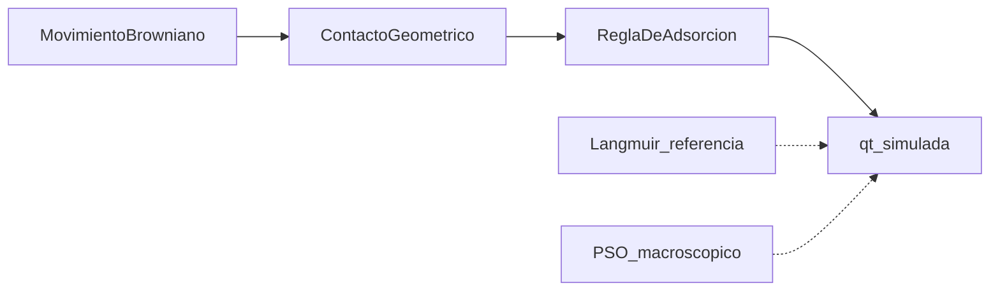
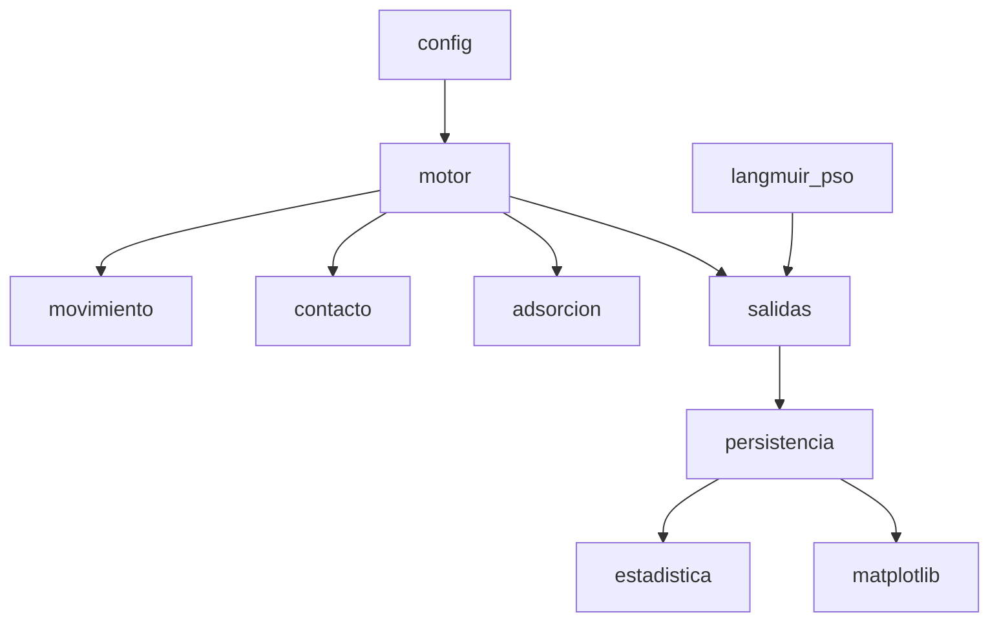

# Contrato de implementación — Fase 1

Este documento es la especificación técnica GO–MB materializada en el repositorio.
No inventa parámetros físicos. Los estados PENDIENTE se conservan.
La implementación posterior inyecta D, P, Nrep y radios como parámetros **etiquetados**, nunca como literatura.

# Fase 1 definitiva — Especificación técnica GO–MB

**Estado de esta entrega:** contrato científico de Fase 1 (secciones 1–23). El código posterior implementa este contrato; no lo sustituye.

**Estado de implementación (solo decisiones ya programadas, no física nueva):**

- Recinto 442×442 px; 200 MB × 0,02 mg (5×5); 100 GO × 0,10 mg (7×7).
- Movimiento Δx,Δy ~ N(0,σ²) con σ inyectado; rebote por reflexión por eje y recorte; solo MB libres y GO se mueven.
- Contacto únicamente si d ≤ rMB + rGO (círculos inscritos: 2,5 y 3,5 px). Sin probabilidad de colisión.
- Adsorción por defecto: contacto + capacidad restante ≥ 0,02 mg → adsorbe el objeto entero. **DECISIÓN COMPUTACIONAL PROVISIONAL equivalente a P_ads=1.** No es dato físico ni bibliográfico. P_ads de literatura sigue PENDIENTE.
- Langmuir y PSO viven en `models`/`metrics` (referencia). No entran en el detector ni en la regla de adsorción.
- Semilla por corrida (`numpy.random.default_rng(seed)`). Motor headless independiente de Matplotlib.
- Conservación: MasaMB + Mlibre = 4 mg en cada registro.
- σ y P se inyectan por corrida (`--sigma`, `--steps`). No son valores científicos definitivos.
- Un recuento de demo (p. ej. 146/200) es **demostración computacional**, no validación experimental.

Detalle operativo: [`docs/PENDIENTES.md`](PENDIENTES.md).

**Fuente principal:** PDF `1º Simulacion.pdf` (*Simulación 1 — Nanopartículas de óxido de grafeno*).

**Contexto:** una versión anterior del documento produjo un plan previo. Ese plan no es fuente de verdad. Las correcciones confirmadas con la autora se aceptan y **no se vuelven a marcar como error**.

**Correcciones ya validadas (no reabrir):**

- Sistema: 40 mL, 10 mg GO, 4 mg MB, **100** unidades GO, **200** unidades MB.
- Concentración de GO: 10 mg / 0,04 L = **250 mg/L = 0,25 g/L**.
- Concentración inicial de MB: 4 mg / 0,04 L = **100 mg/L = 0,1 g/L**.
- 1 px ≈ **77,4 μm** de lado.
- Área de 1 px: **77,4² = 5990,76 μm²** (no 5987,76).
- Dominio: **442 × 442 = 195364 px²**.
- Superficie física: **3,42 × 3,42 = 11,6964 cm²**, coherente con 442² × 5990,76 ≈ 1,170×10⁹ μm² ≈ **11,70 cm²**.

**Regla de esta spec:** si el PDF no da un dato necesario para implementar, el estado es **PENDIENTE**. No se inventa.

Las ecuaciones de movimiento, contacto, Langmuir, balance de masa y PSO aparecen en el PDF como imágenes. Se transcribe lo que el texto circundante hace inequívoco. Donde la imagen no basta, se marca PENDIENTE.

---

## Validación matemática previa

Convención: FÓRMULA → SUSTITUCIÓN → RESULTADO → UNIDAD.

### V1. Volumen, recinto y cubo equivalente

- V = 40 mL = 40 cm³ = 0,04 L. DOCUMENTADO.
- Lado del recinto en planta: 3,42 cm. DOCUMENTADO.
- Área: A = L² → 3,42² → **11,6964 cm²**. CALCULADO / confirmado.
- Volumen de un cubo de arista 3,42 cm: L³ → 3,42³ → **40,002 cm³ ≈ 40 mL**. Coherente. No es contradicción.

### V2. Concentraciones

- C_GO = m_GO / V → 10 / 0,04 → **250 mg/L = 0,25 g/L**. CALCULADO / confirmado.
- C_MB = Co = m_MB / V → 4 / 0,04 → **100 mg/L = 0,1 g/L**. CALCULADO / confirmado.
- El PDF, en el bloque de recuento de partículas, aún escribe «Concentración de MB: 0,25 g/L». Esa etiqueta es la concentración de **GO**. La autora ya la corrigió. El valor de trabajo de Co es **100 mg/L**. No se reabre como error del modelo.

### V3. Malla y escala

- Npx = 442 × 442 → **195364 px²**. CALCULADO / confirmado.
- 1 px (lado) = 0,00774 cm = 77,4 μm. DOCUMENTADO / confirmado (redondeo de 3,42/442 = 0,0077376 cm = 77,376 μm).
- Área de 1 px: 77,4² → **5990,76 μm²**. CALCULADO / confirmado.
- Comprobación de superficie: 195364 × 5990,76 → **1,170378837×10⁹ μm² = 11,7038 cm² ≈ 11,70 cm²**. Diferencia vs 11,6964 cm² ≈ **0,06 %**, redondeo de 77,4 μm. Coherente. No es error nuevo.
- El PDF escribe también «5,99 μm²» y «5991 μm² aprox.» para el área del píxel. Se interpreta como notación/redondeo de **5990,76 μm²**, no como un tercer valor físico.

### V4. Masas por unidad computacional

- peso_MB = 4 / 200 → **0,02 mg/objeto**. CALCULADO. DOCUMENTADO en el PDF.
- peso_GO = 10 / 100 → **0,10 mg/objeto**. CALCULADO. DOCUMENTADO en el PDF.

### V5. qmax y capacidad por unidad

- qmax = 764,7 mg/g. DOCUMENTADO [1] Ortiz-Anaya, pH 6, 25 °C.
- Masa máxima adsorbible total: qmax · m_GO → 764,7 mg/g × 0,01 g → **7,647 mg MB**. DOCUMENTADO / CALCULADO.
- Capacidad máxima por unidad GO: 764,7 × 0,0001 g → **0,07647 mg MB / unidad**. DOCUMENTADO / CALCULADO.
- Equivalente en objetos MB: 0,07647 / 0,02 → **3,8235 objetos MB / unidad GO**. CALCULADO. El PDF no redondea este número.
- Carga total de MB (4 mg) < capacidad de saturación (7,647 mg). El sistema **no puede** alcanzar qmax. q máximo posible si se adsorbiera todo el MB: 4 / 0,01 → **400 mg/g**.

### V6. Langmuir + balance de masa (referencia de equilibrio)

Ecuaciones del PDF:

- qe = qmax · KL · Ce / (1 + KL · Ce)
- qe = (Co − Ce) · V / m

Sustitución: qmax = 764,7 mg/g; KL = 0,206 L/mg; Co = 100 mg/L; V = 0,04 L; m = 0,01 g.

- V/m → 0,04 / 0,01 → **4 L/g**
- qe = 4 (100 − Ce) = 400 − 4 Ce
- KL · qmax → 0,206 × 764,7 → **157,5282 L/g**
- Ecuación en Ce: 0,824 Ce² + 79,1282 Ce − 400 = 0
- Ce → **4,814 mg/L ≈ 4,81 mg/L**. CALCULADO. Coincide con el PDF.
- qe → **380,745 mg/g ≈ 380,7 mg/g**. CALCULADO. Coincide con el PDF.

Cierre de masa:

- Mads_eq = 380,745 × 0,01 → **3,807 mg**
- Mlibre_eq = 4,814 × 0,04 → **0,193 mg**
- Suma → **4,000 mg**. Cierra.
- % eliminación de referencia: 3,807 / 4 × 100 → **95,19 %**
- % de qmax de referencia: 380,7 / 764,7 × 100 → **49,79 %**
- Objetos MB adsorbidos de referencia: 3,807 / 0,02 → **190,37** de 200
- PDF: 10 mg GO → 3,807 mg; 0,1 mg GO → 0,03807 mg. Coincide.

**Uso:** referencia macroscópica. **Prohibido** detener o sesgar la simulación para clavar 380,7 mg/g.

### V7. PSO (referencia cinética, artículo [2])

El PDF toma de [2] (Chia et al.), solo C0 = 100 mg/L:

- qe experimental = 385,76 mg/g
- PSO: qe = 384,6 mg/g; R² = 1
- PFO: qe = 13,29 mg/g; R² = 0,252 → se descarta PFO
- k2 escrito de dos maneras en el PDF: «K2 = 0,001» en la tabla transcrita y **k2 = 0,0002 g/(mg·min)** en el ejemplo trabajado y en la calibración temporal

Forma integrada (texto del PDF + uso estándar):

- qt = (k2 · qe² · t) / (1 + k2 · qe · t)

Ejemplo del PDF a t = 10 min, con k2 = 0,0002 g/(mg·min) y qe = 384,6 mg/g:

- qt(10) → **167,21 mg/g**
- masa en 10 mg GO → 167,21 × 0,01 → **1,672 mg**
- objetos → 1,672 / 0,02 → **83,6 ≈ 84** de 200

El ejemplo **solo cierra** con k2 = **0,0002** g/(mg·min). Con k2 = 0,001 se obtendría 3,052 mg a t = 10 min, distinto del PDF.

**Discrepancia no corregida:** con k2 = 0,0002, a 30 min qt ≈ 268 mg/g (70 % de 384,6), no una meseta en ~385 mg/g. El propio PDF describe la Figura 3 como meseta ≈ 385 mg/g a los 20–30 min. Eso no es compatible con k2 = 0,0002. **PENDIENTE:** qué k2 es la referencia cinética oficial. El ejemplo numérico usa 0,0002; la tabla transcribe 0,001; la figura cualitativa no cuadra con 0,0002.

Condiciones de [2]: pH 7 y 20 °C. Ortiz: pH 6 y 25 °C. El PDF exige tratar [2] como **referencia cinética complementaria**, no como reemplazo de qmax y KL de Ortiz. Qo = 476,2 mg/g y b = 0,189 de [2] **no se usan** en el equilibrio de la simulación.

### V8. Tamaños físicos vs gráficos

- Lámina GO representativa: 1,5 × 1,5 μm → 2,25 μm². Literatura secundaria Zhang et al. (2018). HIPÓTESIS de un único valor (punto medio 1–2 μm).
- Molécula MB: 1,43 × 0,61 nm → 0,8723 nm² = **8,723×10⁻⁷ μm²**. DOCUMENTADO.
- Razón de áreas: 2,25 / 8,723×10⁻⁷ → **2,58×10⁶**. CALCULADO. Coincide.
- 1 lámina 2,25 μm² / 5990,76 μm²/px → **3,76×10⁻⁴ px²**. Invisible. Justifica ampliación computacional.
- GO gráfico: **7 × 7 = 49 px²**. DECISIÓN COMPUTACIONAL.
- MB gráfico: **5 × 5 = 25 px²**. DECISIÓN COMPUTACIONAL.
- Si se conservara la razón real con GO = 49 px², MB tendría lado ≈ 0,004 px. Coincide con el PDF.
- Si MB = 25 px² a escala real, GO ≈ 8030 px de lado > 442. Coincide.
- Ocupación MB: 200 × 25 = 5000 px² → 5000 / 195364 → **2,56 %**. DOCUMENTADO / CALCULADO.
- Ocupación GO: 100 × 49 = 4900 px² → **2,51 %**. CALCULADO (el PDF no escribe este porcentaje).
- Estas áreas gráficas **no cambian** masa, qmax, KL ni Co. Sí pueden cambiar la frecuencia de contactos. Deben ser constantes en todas las corridas comparables.

### V9. Fórmulas de salida que el PDF sí escribe, y una que no cierra

- % adsorbido = (Nads / No) · 100. DOCUMENTADO. Aquí Nads = colorantes adsorbidos; No = 200.
- MasaMB = Nads · peso_MB. DOCUMENTADO.
- Mlibre = Mo − Mads. DOCUMENTADO. Unificar Mads ≡ MasaMB.
- El PDF titula «concentración de MB **restante**» y escribe CMB = MasaMB / V.
  - Si MasaMB es masa **adsorbida**: 3,807 / 0,04 → **95,19 mg/L** = Co − Ce, no Ce.
  - La concentración restante de equilibrio es Mlibre / V → 0,193 / 0,04 → **4,81 mg/L**.
  - **PENDIENTE de notación:** la magnitud pedida es la restante; la fórmula usa masa adsorbida. No se corrige en silencio.
- % qmax = (qfinal / qmax) · 100. DOCUMENTADO.
- qt: el PDF deja «es decir:» sin fórmula. Por el resto del documento, qt está en mg/g. La definición coherente con PSO y con qe es qt = MasaMB(t) / m_GO, con m_GO = 0,01 g. **PENDIENTE** confirmar esa escritura (no está en la lista de resultados).

---

## 1. Objetivo científico

Simular, a nivel **macroscópico y estadístico**, la adsorción de azul de metileno en óxido de grafeno en las condiciones de Ortiz-Anaya y Nishina (pH 6, 25 °C, V = 40 mL, 10 mg GO, 4 mg MB).

El experimento computacional debe permitir:

- observar la evolución de masa, concentración y porcentaje de MB;
- comparar la capacidad simulada con la referencia Langmuir (qe ≈ 380,7 mg/g, Ce ≈ 4,81 mg/L);
- comparar la forma temporal con la referencia PSO de [2] (sin pretender que pH y T sean idénticos);
- cuantificar la variabilidad entre repeticiones debida al azar.

No es un modelo molecular. Cada objeto computacional representa una **fracción de masa**, no una molécula.

Existe un segundo sistema (CA) en el enunciado comparativo: CA inmóvil, distinto qmax y KL. Este PDF es *Simulación 1 (GO)*. Los parámetros de CA **no están en este documento**.

## 2. Objetivo computacional

Construir un motor 2D, ejecutable sin interfaz, que separe:

1. movimiento browniano simplificado;
2. detección geométrica de contacto;
3. regla de adsorción posterior al contacto;
4. Langmuir como referencia de equilibrio (no como freno);
5. PSO como referencia cinética y, más adelante, como base de calibración pasos ↔ minutos **a posteriori**.

Salidas persistidas: parámetros, semilla, series temporales, finales, velocidad en pasos, estadísticos de las repeticiones.

Python + NumPy + Matplotlib. Sin frameworks adicionales.

## 3. Condiciones experimentales

Origen: bloque inicial del PDF, fuente [1].

- Temperatura: 25 °C
- pH: 6
- V: 40 mL = 0,04 L
- Dosis GO: 10 mg = 0,01 g
- Dosis MB: 4 mg
- Co (MB): 100 mg/L
- C_GO: 250 mg/L (dosis de adsorbente, no de MB)

Referencia cinética complementaria [2]: C0 = 100 mg/L, pH 7, T = 20 °C (293 K). Solo la serie 100 mg/L. No sustituye a [1] en el equilibrio.

## 4. Tabla completa de parámetros

Formato: nombre — símbolo — valor — unidad — función — origen — estado.

- Temperatura — T — 25 — °C — condición de [1] — experimental [1] — DOCUMENTADO
- pH — — 6 — — condición de [1] — experimental [1] — DOCUMENTADO
- Volumen — V — 0,04 — L — disolución y balance de masa — experimental [1] — DOCUMENTADO
- Masa GO — m — 0,01 — g — dosis adsorbente; denominador de qt, qe — experimental [1] — DOCUMENTADO
- Masa MB inicial — Mo — 4 — mg — carga de colorante — experimental [1] — DOCUMENTADO
- Concentración inicial MB — Co — 100 — mg/L — Langmuir y PSO — 4/0,04 — CALCULADO
- Concentración GO — C_GO — 250 — mg/L — dosis adsorbente — 10/0,04 — CALCULADO
- qmax GO — qmax — 764,7 — mg/g — meseta Langmuir — [1] — DOCUMENTADO
- KL GO — KL — 0,206 — L/mg — afinidad Langmuir — [1] — DOCUMENTADO
- Ce referencia — Ce — 4,81 — mg/L — equilibrio Langmuir+balance — ver V6 — CALCULADO
- qe Langmuir — qe_L — 380,7 — mg/g — equilibrio de la simulación (referencia) — ver V6 — CALCULADO
- qe PSO [2] — qe_PSO — 384,6 — mg/g — cinética complementaria — [2] — DOCUMENTADO
- qe exp. [2] — — 385,76 — mg/g — dato experimental de la tabla cinética — [2] — DOCUMENTADO
- k2 — k2 — 0,0002 (ejemplo) / 0,001 (tabla) — g/(mg·min) — PSO — [2] — **PENDIENTE de unificación**
- Nº MB — No / N_MB — 200 — objetos — discretización del colorante — decisión de modelo — DECISIÓN COMPUTACIONAL
- Nº GO — N_GO — 100 — objetos — discretización del adsorbente — decisión de modelo — DECISIÓN COMPUTACIONAL
- Masa por MB — peso_MB — 0,02 — mg/objeto — conversión objeto → mg — 4/200 — CALCULADO
- Masa por GO — peso_GO — 0,10 — mg/objeto — conversión objeto → mg — 10/100 — CALCULADO
- Capacidad másica por GO — cap_GO — 0,07647 — mg MB/objeto GO — tope local de monocapa másica — 764,7×0,0001 — CALCULADO
- Recinto físico — L — 3,42 — cm — lado del dominio — proyección 2D de 40 mL — DOCUMENTADO
- Recinto gráfico — — 442 × 442 — px — malla — decisión de modelo — DECISIÓN COMPUTACIONAL
- Escala lineal — — 77,4 — μm/px — conversión dominio — confirmada — DOCUMENTADO
- Área de píxel — — 5990,76 — μm² — conversión de área — 77,4² — CALCULADO
- Tamaño gráfico GO — — 7 × 7 — px — visibilidad y contacto — decisión de modelo — DECISIÓN COMPUTACIONAL
- Tamaño gráfico MB — — 5 × 5 — px — visibilidad y contacto — decisión de modelo — DECISIÓN COMPUTACIONAL
- Escala browniana — D (σ) — no dado — px/paso — magnitud de Δx, Δy — listado como parámetro — **PENDIENTE**
- Pasos totales — P — no dado — pasos — horizonte — listado como parámetro — **PENDIENTE**
- Semilla — seed — una por corrida — — reproducibilidad — requisito del PDF — DECISIÓN COMPUTACIONAL (esquema)
- P(adsorción \| contacto) — P_ads — no existe en literatura — — regla estocástica post-contacto — limitación del PDF — **PENDIENTE**
- Radios circulares — rMB, rA — no numéricos — px — umbral de contacto — geometría circular sobre cuadrados — **PENDIENTE**
- qmax, KL, k2, N, tamaño, layout de CA — — no dados — — sistema comparativo — PDF menciona CA sin parametrizarlo — **PENDIENTE**
- Número de repeticiones — Nrep — 40 (FAQ) vs 30 (estadísticos) — corridas/sistema — campaña — PDF contradictorio — **PENDIENTE**

## 5. Parámetros bibliográficos

De [1] Ortiz-Anaya y Nishina (pH 6, 25 °C), equilibrio de **esta** simulación:

- qmax = 764,7 mg/g
- KL = 0,206 L/mg
- Premisas de área (contexto, no se simulan): MB homogéneo en superficie; bordes despreciables; sin enlace químico; área proyectada MB = 108 Ų/molécula; qm de monocapa sin criterio universal único

De Zhang et al. (2018), solo tamaño lateral de láminas:

- mayoría 1–2 μm; valor único 1,5 μm

De [2] Chia et al. (pH 7, 20 °C), **solo cinética y justificación de PSO**, serie 100 mg/L:

- qe exp. = 385,76 mg/g
- PSO qe = 384,6 mg/g, R² = 1
- PFO descartado
- k2: ver PENDIENTE de unificación
- Langmuir de [2] a 20 °C (Qo = 476,2 mg/g, b = 0,189) **no sustituye** a [1]

## 6. Parámetros derivados

Ver sección de validación. Resumen operativo:

- C_GO = 250 mg/L
- Co = 100 mg/L
- peso_MB = 0,02 mg
- peso_GO = 0,10 mg
- cap_GO = 0,07647 mg MB/unidad
- Ce = 4,81 mg/L
- qe_L = 380,7 mg/g
- Mads_eq = 3,807 mg
- objetos de referencia al equilibrio Langmuir ≈ 190,37
- ocupación MB = 2,56 %; GO = 2,51 %
- Ejemplo PSO (si k2 = 0,0002): t = 10 min → 1,672 mg → ≈ 84 objetos

α (min/paso) **no** es un parámetro de entrada. Se podrá estimar después comparando n_sim y t_PSO en varios porcentajes. Hasta entonces un paso no es un minuto.

## 7. Decisiones computacionales

Deben etiquetarse siempre como tales, nunca como propiedades físicas reales:

- sistema 2D en 442 × 442 px;
- 200 objetos MB de 5 × 5 px y 100 objetos GO de 7 × 7 px;
- ampliación geométrica respecto a 1,5 μm y a ~nm de MB;
- contacto por círculos equivalentes (radios aún PENDIENTE);
- GO móvil; CA inmóvil si se implementa;
- rebote en paredes;
- semilla por corrida;
- D y P, cuando se fijen, serán computacionales.

El PDF afirma que agrandar objetos no cambia masa ni qmax/KL/Co, pero **sí puede cambiar la frecuencia de contactos**. Por eso esos tamaños se congelan entre corridas comparables.

## 8. Hipótesis y simplificaciones

- Bidimensional, no molecular.
- GO representativo móvil; MB representativo móvil; CA inmóvil bajo la superficie (sistema 2, no parametrizado aquí).
- Browniano simplificado: Δx, Δy ~ normal(0, σ²).
- Contacto geométrico; **cero** probabilidad arbitraria de colisión.
- Langmuir = referencia de equilibrio; PSO = referencia cinética macroscópica.
- Un objeto GO puede adsorber **varios** objetos MB hasta agotar la capacidad másica que le corresponde (0,07647 mg). El PDF corrige la monocapa 1:1 de la versión anterior.
- Sitio/capacidad ocupada deja de estar disponible.
- Langmuir menciona adsorción/desorción dinámicas a escala de equilibrio; el bucle de objetos **no** describe desorción de un MB ya adsorbido. HIPÓTESIS operativa: adsorción irreversible a escala de objeto, salvo decisión posterior.
- Pasos ≠ tiempo real hasta calibrar α.
- No se simulan agua, orbitales, porosidad microscópica ni interacciones MB–MB.

## 9. Representación computacional

Tres capas, nunca mezclarlas en un mismo número sin etiqueta.

**Física:** cubo/planta 3,42 cm; 40 mL; 10 mg GO; 4 mg MB; láminas ~1,5 μm; molécula MB ~nm.

**Unidades de masa:** 100 GO × 0,10 mg; 200 MB × 0,02 mg.

**Gráfica:** 442 × 442 px; GO 7×7; MB 5×5; 1 px = 77,4 μm = 5990,76 μm². Paredes = bordes del array.

Un objeto MB adsorbido deja de ser «libre» para el movimiento. Un objeto GO sigue existiendo y puede seguir moviéndose mientras le quede o no capacidad (el PDF no dice que el GO se detenga al adsorber). **PENDIENTE:** si un GO saturado sigue difundiendo (irrelevante para adsorción futura, sí para contactos residuales contados).

## 10. Movimiento browniano

Solo partículas **libres** de MB y unidades de GO.

En cada paso:

- Δx, Δy extraídos de una normal centrada en 0;
- σ = D controla la magnitud (el PDF escribe «o»);
- posición ← posición + (Δx, Δy);
- si cruza el borde: **rebote** (algoritmo exacto no descrito → PENDIENTE de implementación, no de física nueva).

CA, si existe, no se mueve. No hay probabilidad de colisión en este módulo. D sin valor: el módulo se puede programar con D como parámetro inyectado; no se inventa un D físico.

## 11. Contacto

Tras el movimiento. Geometrías **circulares**:

- d = sqrt((x_MB − x_A)² + (y_MB − y_A)²)
- contacto si d ≤ rMB + rA

Sin RNG en el detector. Cada contacto válido se cuenta (acumulado MB–GO).

Participan: MB libre y un adsorbente. El PDF no pide contactos MB–MB ni GO–GO como eventos de adsorción.

**PENDIENTE:** rMB y rA a partir de cuadrados 5×5 y 7×7 (inscrito: 2,5 y 3,5 px; no está escrito). Orden intra-paso (mover ambos y luego detectar, un MB contra varios GO). CA sin geometría.

## 12. Adsorción

El contacto solo hace **candidato**. Luego la regla de adsorción.

Definido:

- cadena movimiento → contacto → adsorción;
- GO con capacidad másica múltiple hasta 0,07647 mg;
- no hay P_ads de literatura;
- no hay probabilidad de colisión;
- Langmuir/PSO no describen el choque individual.

No definido (bloquea un cierre físico completo de la Fase 5):

- valor de P_ads;
- si P_ads = 1 cuando cabe la masa del objeto MB, o es estocástica;
- cómo tratar el resto 0,00347 mg (3×0,02 = 0,06 < 0,07647): ¿se adsorbe un 4.º objeto (0,08 > 0,07647) o se rastrea capacidad en mg y solo se acepta un objeto entero si cap_restante ≥ 0,02?;
- si PSO «gobierna la probabilidad tras cada contacto» (frase del PDF) o solo se usa α a posteriori (desarrollado con más detalle en las pp. 20–21). Son dos diseños distintos. **PENDIENTE**.

**Prohibido:** ajustar P_ads para clavar qe = 380,7 mg/g.

Hasta decidir P_ads, el motor puede contar contactos y, como máximo, aplicar una regla **documentada como decisión**, no como dato de [1] o [2].

## 13. Langmuir

qe = qmax KL Ce / (1 + KL Ce), más qe = (Co − Ce) V / m.

Para GO en nuestras condiciones: Ce = 4,81 mg/L, qe = 380,7 mg/g.

En el software:

- calcular una vez la referencia y guardarla en metadatos;
- no usarla como condición de parada;
- no usarla para aceptar/rechazar choques;
- qfinal y % qmax se miden sobre la corrida.

Sin qmax/KL de CA no hay referencia CA.

## 14. PSO

Idea: velocidad alta lejos del equilibrio, luego frena.

- qt: mg MB / g GO en el instante t
- qe: valor de equilibrio del modelo cinético (384,6 mg/g en [2]; distinto de 380,7 de Langmuir-[1])
- k2: constante (unificación PENDIENTE)
- t: minutos en [2]; pasos en la simulación

Forma integrada usada en el ejemplo del PDF: qt = k2 qe² t / (1 + k2 qe t).

Uso previsto:

1. El motor produce qt(paso) con qt = MasaMB / 0,01 g (definición a confirmar, sección V9).
2. PSO no mueve partículas.
3. Tras la corrida, comparar fracciones de adsorción: n_sim(f) vs t_PSO(f); α = t_PSO / n_sim.
4. No fijar α de antemano. Solo si α es aproximadamente constante en 10…90 % se podrá hablar de minutos.

**PENDIENTE:** fracción respecto a qe_L = 380,7 o qe_PSO = 384,6. El PDF usa «equilibrio» para la simulación y qe = 384,6 para t_PSO.

## 15. Variables de salida

Por corrida, guardado automático: parámetros, semilla, evolución, cantidad final, velocidad.

- Nads (colorantes adsorbidos) y % = (Nads / No) · 100, No = 200
- Nlibres
- MasaMB = Nads · 0,02 mg
- Mlibre = 4 − MasaMB
- CMB: ver discrepancia MasaMB/V vs Mlibre/V
- qt(paso) y qfinal
- % qmax = (qfinal / 764,7) · 100
- contactos acumulados MB–GO
- velocidad en **pasos** (fórmula exacta no escrita; Δq/Δpasos es la lectura natural)
- pasos al 10, 20, …, 100 % «de su adsorción hasta el equilibrio» (¿de qe_L, qfinal o qmax? PENDIENTE)
- series: % eliminación, qt, concentración vs pasos
- tras Nrep: media, s; IC 95 % opcional (N, X, t de Student, s; fórmula completa no escrita)
- comparación GO vs CA cuando CA exista

Desambiguar en implementación: `n_adsorbed` vs `n_adsorbent`; `m_adsorbed` vs `m_adsorbent`. El PDF usa Nads para ambos.

## 16. Diseño de experimentos

- Sistema 1: GO móvil, parámetros de esta spec.
- Sistema 2: CA inmóvil, qmax y KL distintos. **No ejecutable** con este PDF solo.
- FAQ: 40 corridas/sistema, 80 total. Apartado estadístico: 30. PENDIENTE.
- Independencia: cada corrida, semilla nueva, RNG propio.
- No descartar corridas por desviarse de 380,7 mg/g.
- Motor headless. GUI no es el experimento (el PDF insiste en que el experimento son las métricas; la animación es vista).

## 17. Repeticiones y semillas

- Una semilla distinta por repetición, persistida con resultados.
- Misma semilla ⇒ mismos Δx, Δy y mismas decisiones estocásticas posteriores.
- Esquema numérico de semillas: decisión computacional (p. ej. base_GO + i). Obligatorio persistir, no un formato concreto.
- No compartir estado RNG entre corridas.

## 18. Análisis estadístico

- Media y desviación estándar de variables principales.
- IC 95 % opcional: N, X, t crítico, s. No da gl ni t_{0,025,N−1}. Si se implementa: X ± t · s / sqrt(N), con t de tablas, etiquetado como método estadístico, no como dato de adsorción.
- N de la fórmula está escrito como 30, en conflicto con 40 del FAQ.

## 19. Arquitectura del software

Python, NumPy, Matplotlib. Motor independiente de la vista.

Componentes previstos (no crearlos en Fase 1):

- `config`: valores + origen + estado (DOCUMENTADO / CALCULADO / DECISIÓN / HIPÓTESIS / PENDIENTE)
- `state`: posiciones, tamaños, flag libre/adsorbido, capacidad másica restante por GO
- `motion`: browniano + rebote
- `contact`: d ≤ rMB+rA, contador
- `adsorption`: regla post-contacto; sin P_ads inventado
- `models`: Ce, qe_L, curva PSO analítica; fuera del detector
- `engine`: bucle mover → contactar → adsorber → registrar
- `metrics` / `io`: JSON/CSV por corrida
- `experiments`: campaña Nrep
- `stats`: media, s, IC opcional
- `viz`: Matplotlib en Fase 8

## 20. Las 8 fases de implementación

### Fase 1 — Planificación, validación y especificación

- **Objetivo:** este documento como contrato.
- **Funcionalidades:** inventario de parámetros, validación V1–V9, lista PENDIENTE. Cero código de simulación.
- **Parámetros utilizados:** todos los de las secciones 3–7, solo sobre el papel.
- **Archivos:** este plan. Opcionalmente, más adelante, `docs/especificacion.md` (no ahora).
- **Entradas:** PDF actual + correcciones de la autora.
- **Salidas:** spec + tabla final + PENDIENTES.
- **Tests:** cada magnitud derivada tiene FÓRMULA → SUSTITUCIÓN → RESULTADO; Ce y qe reproducen 4,81 y 380,7; 77,4² = 5990,76; 200×0,02 = 4; 100×0,1 = 10.
- **Criterio de finalización:** las 23 secciones entregadas; no se ha inventado P_ads, D, P ni CA; no se pasa a Fase 2 sin aprobación.
- **Fuera:** cualquier `.py`, GUI, valores inventados.

### Fase 2 — Motor básico y representación

- **Objetivo:** instanciar el dominio GO–MB.
- **Funcionalidades:** recinto 442×442; 200 MB 5×5; 100 GO 7×7; posiciones iniciales sin solapamiento no especificado (si no está en el PDF, regla de colocación = decisión computacional documentada); serializar config.
- **Parámetros:** L, Npx, N_MB, N_GO, tamaños px, pesos.
- **Componentes:** `config`, `state`, `engine` (paso nulo).
- **Entradas:** tabla de esta spec.
- **Salidas:** estado inicial reproducible.
- **Tests:** recuentos 200/100; objetos dentro; área gráfica 5000 y 4900 px²; semilla guardada.
- **Criterio:** se crea un sistema GO y se escribe el estado.
- **Fuera:** browniano, contactos, adsorción, Langmuir/PSO, GUI, CA, 30/40 reps.

### Fase 3 — Movimiento browniano

- **Objetivo:** actualizar posiciones.
- **Funcionalidades:** Δ ~ N(0, D²) para MB libre y GO; rebote; CA fijo si existiera.
- **Parámetros:** D (inyectado, valor PENDIENTE), P (inyectado, valor PENDIENTE).
- **Componentes:** `motion`.
- **Entradas:** estado Fase 2, D, P.
- **Salidas:** trayectorias.
- **Tests:** misma semilla ⇒ misma trayectoria; nada fuera del recinto; GO se mueve.
- **Criterio:** movimiento reproducible y acotado.
- **Fuera:** contacto, adsorción, modelos macroscópicos, GUI.

### Fase 4 — Contacto y colisiones

- **Objetivo:** detectar y contar.
- **Funcionalidades:** d ≤ rMB+rA; acumulado; sin adsorber.
- **Parámetros:** rMB, rA (PENDIENTE de fijar a partir de 5 y 7 px).
- **Componentes:** `contact`.
- **Entradas:** posiciones.
- **Salidas:** lista/contador de contactos.
- **Tests:** umbral exacto sí/no; detector sin RNG.
- **Criterio:** el recuento es función pura de la geometría.
- **Fuera:** P_ads, Langmuir, PSO, GUI.

### Fase 5 — Adsorción

- **Objetivo:** regla post-contacto y conservación de masa.
- **Funcionalidades:** candidato tras contacto; descontar capacidad másica del GO; marcar MB adsorbido; actualizar MasaMB, Mlibre.
- **Parámetros:** peso_MB, cap_GO; P_ads PENDIENTE.
- **Componentes:** `adsorption`.
- **Entradas:** contactos + capacidades.
- **Salidas:** estado adsorbido, masas.
- **Tests:** sin contacto ⇒ no adsorbe; cap_restante < 0,02 ⇒ no admite otro objeto entero; MasaMB + Mlibre = 4; un MB no se adsorbe dos veces.
- **Criterio:** cadena completa con regla **escrita** (decisión o PENDIENTE resuelto por la autora). Sin clavar 380,7.
- **Fuera:** forzar qe; inventar P_ads; GUI; CA.

### Fase 6 — Langmuir y PSO

- **Objetivo:** referencias macroscópicas.
- **Funcionalidades:** calcular Ce, qe_L; series qt(paso); curva PSO analítica con el k2 que se unifique; no acoplar al detector.
- **Parámetros:** qmax, KL, Co, V, m, qe_PSO, k2.
- **Componentes:** `models`, `metrics`.
- **Entradas:** masas simuladas + constantes [1]/[2].
- **Salidas:** metadatos de referencia, curvas comparativas.
- **Tests:** inputs del PDF ⇒ Ce ≈ 4,81 y qe ≈ 380,7; ejemplo t = 10 min ⇒ 1,672 mg si k2 = 0,0002; el detector no consulta Langmuir.
- **Criterio:** referencia y qt simulada conviven sin que una fuerce a la otra.
- **Fuera:** α numérico definitivo; minutos en el motor; parámetros CA; GUI.

### Fase 7 — Experimentos, datos y análisis estadístico

- **Objetivo:** campaña y estadísticos.
- **Funcionalidades:** Nrep corridas GO; persistencia; pasos a 10…90 %; media y s; IC opcional; α exploratorio t_PSO/n_sim; CA solo si hay parámetros.
- **Parámetros:** semillas, Nrep (PENDIENTE 30/40).
- **Componentes:** `experiments`, `stats`, `io`.
- **Entradas:** motor Fases 2–6.
- **Salidas:** CSV/JSON + resumen.
- **Tests:** semillas distintas; relanzar una semilla reproduce el archivo.
- **Criterio:** campaña GO reproducible con estadísticos. Comparación CA aplazada si sigue PENDIENTE.
- **Fuera:** GUI; rellenar CA con literatura externa al PDF.

### Fase 8 — Interfaz y despliegue

- **Objetivo:** ver sin contaminar el experimento.
- **Funcionalidades:** Matplotlib (curvas; animación opcional); lanzar 1 corrida o leer resultados.
- **Parámetros:** ninguno físico nuevo.
- **Componentes:** `viz`.
- **Entradas:** archivos de `io`.
- **Salidas:** figuras.
- **Tests:** motor idéntico con viz desconectada.
- **Criterio:** mismos números headless y con GUI.
- **Fuera:** nueva física.

## 21. Tests previstos (contrato transversal)

- Conservación: 200×0,02 + 100×0,1 masas iniciales; MasaMB + Mlibre = 4 en todo t.
- Ce, qe reproducibles con el sistema de V6.
- Ocupación 5000 y 4900 px².
- Misma semilla, mismo recuento de contactos y de adsorciones.
- Detector geométrico sin azar extra.
- Langmuir no aparece en el `if` de adsorción.
- D, P, P_ads, Nrep, radios, k2 unificado: tests parametrizados, no valores mágicos.

## 22. Limitaciones

Tomadas del PDF (apartado final), sin ampliar física:

- 2D, no molecular; objetos representativos.
- Geometría, tamaño y número no son los reales.
- Browniano y contactos simplificados.
- Sin agua explícita, sin interacciones intermoleculares, sin heterogeneidad superficial.
- El tamaño gráfico influye en la frecuencia de contactos, no en qmax/KL/Co.
- No hay dato experimental de probabilidad por colisión.
- Langmuir y PSO son macroscópicos; [1] y [2] son condiciones próximas, no idénticas.
- Sin calibración α, los pasos no son minutos.

## 23. Puntos pendientes de validación

No se resuelven aquí.

1. **P_ads.** El PDF lo declara inexistente en literatura. Bloquea el cierre de Fase 5.
2. **PSO vs probabilidad.** El PDF plantea o bien α a posteriori, o bien que PSO gobierne P_ads. Hay que elegir. No ambas de forma tácita.
3. **k2 = 0,0002 (ejemplo) vs 0,001 (tabla) vs Figura 3 (meseta 20–30 min).** Inconsistencia interna de [2] según está transcrito.
4. **D (σ) y P.** Listados, sin valor.
5. **Nrep = 40 (FAQ) vs 30 (estadísticos e IC).**
6. **Sistema CA** sin qmax, KL, k2, N, tamaño ni layout.
7. **Radios** rMB, rA a partir de 5×5 y 7×7.
8. **Algoritmo de rebote** y orden intra-paso.
9. **Capacidad 3,8235 objetos/GO:** regla para el resto fraccionario.
10. **CMB = MasaMB / V** vs concentración **restante** (debería ser Mlibre/V si se quiere Ce).
11. **Fórmula de qt** omitida tras «es decir:».
12. **Velocidad:** «durante un intervalo», sin fórmula.
13. **10…100 % de qué equilibrio** (qe_L, qe_PSO, qfinal, qmax).
14. **Desorción** de objetos vs equilibrio dinámico de Langmuir.
15. **t crítico** de Student si se hace IC 95 %.
16. **GO saturado:** ¿sigue moviéndose?
17. **Colocación inicial** (aleatoria, sin solape): no descrita.

No son pendientes (ya cerrados con la autora): Co vs 0,25 g/L; 50 vs 100 GO; 100 vs 200 MB; 5987,76 vs 5990,76 μm²; 11,6964 vs ≈11,70 cm².

---

## Tabla final

Formato pedido: PARÁMETRO | VALOR | UNIDAD | ORIGEN | CÁLCULO | ESTADO

- T | 25 | °C | [1] | — | DOCUMENTADO
- pH | 6 | — | [1] | — | DOCUMENTADO
- V | 0,04 | L | [1] | 40 mL | DOCUMENTADO
- m_GO | 0,01 | g | [1] | 10 mg | DOCUMENTADO
- Mo_MB | 4 | mg | [1] | — | DOCUMENTADO
- C_GO | 250 | mg/L | derivado | 10/0,04 | CALCULADO
- Co_MB | 100 | mg/L | derivado / [1] | 4/0,04 | CALCULADO
- qmax | 764,7 | mg/g | [1] | — | DOCUMENTADO
- KL | 0,206 | L/mg | [1] | — | DOCUMENTADO
- Ce | 4,81 | mg/L | Langmuir+balance | V6 | CALCULADO
- qe_L | 380,7 | mg/g | Langmuir+balance | V6 | CALCULADO
- Mads_eq | 3,807 | mg | derivado | 380,7×0,01 | CALCULADO
- cap_total_qmax | 7,647 | mg | derivado | 764,7×0,01 | CALCULADO
- cap_GO | 0,07647 | mg/unidad | derivado | 764,7×0,0001 | CALCULADO
- qe_PSO | 384,6 | mg/g | [2] | — | DOCUMENTADO
- qe_exp_[2] | 385,76 | mg/g | [2] | — | DOCUMENTADO
- k2 | 0,0002 o 0,001 | g/(mg·min) | [2] | ejemplo vs tabla | PENDIENTE
- N_MB | 200 | objetos | modelo | — | DECISIÓN COMPUTACIONAL
- N_GO | 100 | objetos | modelo | — | DECISIÓN COMPUTACIONAL
- peso_MB | 0,02 | mg | derivado | 4/200 | CALCULADO
- peso_GO | 0,10 | mg | derivado | 10/100 | CALCULADO
- L_recinto | 3,42 | cm | modelo 2D de 40 mL | — | DOCUMENTADO
- A_recinto | 11,6964 | cm² | derivado | 3,42² | CALCULADO
- Npx | 442×442 = 195364 | px² | modelo | 442² | DECISIÓN COMPUTACIONAL
- px_lado | 77,4 | μm | escala | ≈3,42 cm/442 | DOCUMENTADO
- A_px | 5990,76 | μm² | derivado | 77,4² | CALCULADO
- A_px×Npx | ≈11,70 | cm² | comprobación | 195364×5990,76 | CALCULADO
- GO_px | 7×7 = 49 | px² | modelo | — | DECISIÓN COMPUTACIONAL
- MB_px | 5×5 = 25 | px² | modelo | — | DECISIÓN COMPUTACIONAL
- ocupación_MB | 2,56 | % | derivado | 5000/195364 | CALCULADO
- ocupación_GO | 2,51 | % | derivado | 4900/195364 | CALCULADO
- GO_real | 1,5 | μm | Zhang 2018 | punto medio 1–2 | HIPÓTESIS
- MB_real | 1,43×0,61 | nm | PDF | — | DOCUMENTADO
- D / σ | — | px/paso | — | — | PENDIENTE
- P | — | pasos | — | — | PENDIENTE
- P_ads | — | — | no hay literatura | — | PENDIENTE
- rMB, rA | — | px | círculos sobre cuadrados | — | PENDIENTE
- Nrep | 30 o 40 | corridas | PDF | FAQ vs estadísticos | PENDIENTE
- seed | una/corrida | — | requisito | persistir | DECISIÓN COMPUTACIONAL
- α | — | min/paso | calibración a posteriori | t_PSO/n_sim | PENDIENTE (no se fija ahora)
- CA qmax, KL, N, tamaño | — | — | no en este PDF | — | PENDIENTE
- Monocapa másica múltiple | sí | — | PDF actualizado | un GO, varios MB | HIPÓTESIS / DOCUMENTADO
- Sistema 2D | sí | — | hipótesis del modelo | — | HIPÓTESIS

---

**Parada:** Fase 1 cerrada a nivel de especificación. No implementar Fase 2 hasta aprobación explícita. Primera línea de código, cuando se autorice: `config` + estado GO (200 MB, 100 GO, 442×442), no la GUI y no P_ads inventado.
